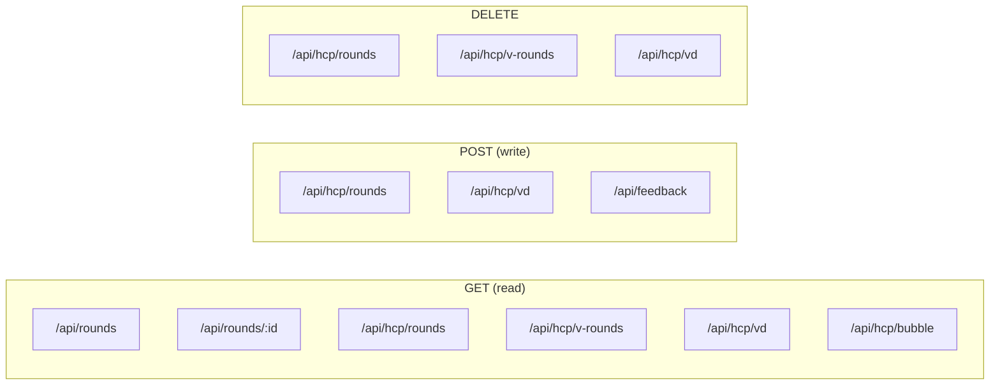

# Analysis App — `golf-analysis/`

Next.js 14+ (App Router) + Tailwind + Recharts. Runs on `localhost:3007`. Reads detailed rounds from the tracker backend (proxied), and reads/writes summary data directly to JSON files in `~/Desktop/golf-handicap/`.

## Tech stack

```json
"next": "App Router (src/app/*)",
"react": "client components (use client)",
"recharts": "all charts",
"tailwindcss": "styling",
"@anthropic-ai/sdk": "feedback/coaching API"
```

## Pages (sidebar nav order)

| Route | Page | Data source |
|-------|------|------|
| `/` | Dashboard — "State of My Game" | `useRounds()` (tracker DB via proxy) |
| `/hcp` | WHS handicap index, differential history, ranked badges | `rounds.json` |
| `/recent-round` | Single-round breakdown + Claude coach feedback | `useRounds()` + `/api/feedback` |
| `/rounds` | Full round list | `useRounds()` |
| `/rounds/[id]` | Round detail | `useRounds()` |
| `/driving` | Driver stats, miss patterns, grade distribution | `useRounds()` |
| `/approach` | Approach by club, GIO%, miss patterns | `useRounds()` |
| `/short-game` | Chip/pitch/sand splits, on-green%, proximity | `useRounds()` |
| `/putting` | Putts/round, make% by distance, 3-putt% | `useRounds()` |
| `/oz-putting` | Make-rate visualization ("Oz") | `useRounds()` |
| `/position` | Position-shot analysis | `useRounds()` |
| `/recovery` | Recovery shots breakdown | `useRounds()` |
| `/penalties` | Penalty-cause analysis | `useRounds()` |
| `/stroke-impact` | Per-shot stroke contribution | `useRounds()` |
| `/trends` | Cross-category time series with HCP overlay | `useRounds()` + `rounds.json` |
| `/vd-match` | VD match scoreboard | `vd.json` + `rounds.json` + `v_rounds.json` |
| `/v-hcp` | V's WHS index | `v_rounds.json` + `rounds.json` |
| `/courses` | Per-course stats | `useRounds()` |
| `/holes` | Per-hole stats | `useRounds()` |
| `/break90` | Break-90 scorecard (target gates) | `useRounds()` |
| `/claude-export` | Export pack for Claude coaching context | `useRounds()` |

## Internal API routes (`src/app/api/`)

### `GET /api/rounds`
Proxies to `http://164.90.139.80/api/rounds`. Cache: `no-store`.

### `GET /api/rounds/[id]`
Proxies to `http://164.90.139.80/api/rounds/:id`.

### `GET /api/hcp/rounds`
Reads `~/Desktop/golf-handicap/rounds.json`. Sorts ASC by date.

### `POST /api/hcp/rounds`
Upsert a summary round in `rounds.json`. New IDs generated as `Date.now().toString(36) + random`.
**Body:** any subset of the rounds.json record shape (see [data-model.md](./data-model.md#roundsjson)).

### `DELETE /api/hcp/rounds`
Body: `{ id }`. Filters out matching record.

### `GET /api/hcp/v-rounds`
Merges:
1. `~/Desktop/golf-handicap/v_rounds.json` (local-only entries)
2. `http://164.90.139.80:8055/api/v-rounds` (DB-derived) — **broken**: this endpoint doesn't exist in `server.py` and uses `:8055` not the Render URL. Falls through silently to local-only.

Each record tagged with `source: 'local' | 'db'`.

### `DELETE /api/hcp/v-rounds`
Only deletes local entries — DB-sourced rounds are read-only here.

### `GET /api/hcp/vd`
Reads `vd.json`.

### `POST /api/hcp/vd`
Append entry: `{ date, vd, h }`. ID auto-assigned `max(id) + 1`.

### `DELETE /api/hcp/vd`
Body: `{ id }`.

### `GET /api/hcp/bubble`
The "bubble round" used by the scorecard PWA for handicap-target display. Reads `rounds.json`, computes WHS handicap, runs `buildRankedBadges(validRecent)` to find the entry tagged `bubble`.
**Returns:** `{ bubbleDiff, hcpIndex }` — both may be `null`.

### `POST /api/feedback`
Streams Claude-generated coaching feedback (model: `claude-opus-4-6`, max_tokens: 1024). Uses Anthropic Messages stream API. Requires `ANTHROPIC_API_KEY` in `.env.local`.

**Body:**
```ts
{
  stats: {
    roundDate, course, nines, score,
    flags: { window, above: Flag[], below: Flag[] },
    driving, approach[], shortGame[], putting[]
  },
  comments: string  // user's free-text notes
}
```
**Returns:** `text/plain; charset=utf-8` stream.

## Endpoint summary



## Client data layer

### `src/lib/api.js`
```js
fetchRounds()        // GET /api/rounds, then GET /api/rounds/:id for each
                     // Filters to r.holes && r.completed
deleteRound(id)      // POST http://164.90.139.80/api/rounds/:id/delete (cross-origin)
```

### `src/lib/RoundsContext.js`
React Context provider. Loads once at mount, exposes `{ rounds, filteredRounds, loading, deleteRound }`.

### `src/lib/analytics.js`
~1340 lines of pure functions. All operate on the **hydrated round** shape (same as the scorecard's `S.active`).

| Function | Purpose |
|---|---|
| `shotStrokeCount(shot)` | Stroke count per shot (incl. putt distances + penalty +1) |
| `getPuttsFromHole(hole)` | Normalize old/new putt models to `[{strides, feet, made}]` |
| `getGIRGIO(hole)` | GIR/GIO booleans + the "green shot" |
| `getProximity(hole)` | Distance of approach shot landing on green |
| `calcRoundStats(round)` | Score, GIR%, putts, etc. for one round |
| `calcDrivingStats(rounds)` | Driver/3W aggregates: F+%, F%, B%, SD%, miss split |
| `calcApproachStats(rounds)` | By approach length (AL/AM/AS/AW): GIO%, badpct |
| `calcApproachClubStats(rounds)` | By approachClub |
| `calcShortGameStats(rounds)` | Chip/pitch/sand types × difficulty, on-green%, proximity |
| `calcPositionStats(rounds)` | Position-shot grading |
| `calcRecoveryStats(rounds)` | Recovery shot outcomes |
| `calcPuttingStats(rounds)` | Make% per distance bucket, 3-putt% per bucket |
| `calcLagPuttingStats(rounds)` | Lag-putt outcomes |
| `calcPenaltyStats(rounds)` | Penalty causes (which shot category preceded) |
| `getTrendData(rounds)` | Time-series for trends page |
| `movingAverage(data, key, w)` | Rolling avg helper |
| `calcStrokeImpact(rounds)` | Best/worst stroke contributions |
| `calcCourseStats(rounds)` | Per-course aggregates |
| `calcShotRankings(round, avgs)` | Identify best/worst shots in a round |
| `calcSD(values)` | Standard deviation helper |

### `src/lib/whs.js`
WHS handicap maths — ported from `golf-handicap/server.py`.

```js
WHS_USE = {3:1, 4:1, 5:1, 6:2, 7:2, 8:2, 9:3, ..., 20:8}
WHS_ADJ = {3:-2.0, 4:-1.0, 5:0, 6:-1.0, 7:0, ..., 20:0}

calcIndex(differentials)        // best-of-N × 0.96
calcAntiIndex(differentials)    // worst-of-N × 0.96 (anti-handicap)
calcDifferential(score, adjScore, rating, slope, pcc=0)
buildRankedBadges(validRecent)  // tags entries: bubble, anti-bubble, hcp#, anti#
```

## Putt distance buckets (`analytics.js`)

```js
PUTT_BUCKETS = [
  ≤2ft  (strides 0,    target 98%),
  3ft   (1,    85%),
  4.5ft (1.5,  68%),
  6ft   (2,    52%),
  7.5ft (2.5,  36%),
  9ft   (3,    20%),
  12ft  (4,    15%),
  15ft  (5,    10%),
  18ft  (6,    10%),
  21ft  (7,    10%),
  24ft  (8,    10%),
  27ft  (9,    10%),
  30ft  (10,   10%),
  37.5ft(12.5, 5%),
  45ft  (15,   5%),
  45+ft (16,   3%)
]
```

Stride-to-feet: `feet = strides × 3` (except `≤2ft` and `45+ft`).
