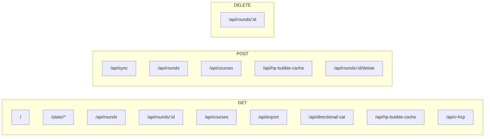

# Backend — `golf-tracker/server.py`

Single-file Python `http.server.BaseHTTPRequestHandler`. ~615 lines. Runs on port 8055. Deployed on Render with persistent disk at `/var/data`.

## Environment

| Var | Default | Purpose |
|-----|---------|---------|
| `PORT` | `8055` | HTTP listener |
| `DATA_DIR` | `./data` | Directory for `rounds.db` + `hp_bubble_cache.json` |
| `DB` | `$DATA_DIR/rounds.db` | SQLite file |
| `VD_JSON` | `~/Desktop/golf-handicap/vd.json` | **Written** by backend on completed VD rounds (only works on dev machine; on Render this write silently fails) |
| `STATIC` | `./static` | Path to PWA assets |

## Endpoints

All responses are JSON unless noted. CORS: `Access-Control-Allow-Origin: *`.

### `GET /`
Serves `static/index.html` with `Cache-Control: no-store`.

### `GET /static/<file>`
Serves PWA assets. `sw.js` is sent with `no-store`; everything else is cached normally.

### `GET /api/rounds`
List all rounds (without holes), ordered by `date DESC, created_at DESC`.

**Returns:** `Round[]` (see [data-model.md](./data-model.md#rounds-table))

### `GET /api/rounds/{id}`
Single round with hydrated holes and shots.

**Returns:** `Round` with `holes: Hole[]`, each hole with `shots: Shot[]` (parsed from `shots_json`)
Server-side rename: snake_case DB → camelCase JS (`vd_honors` → `vdHonors`, `vd_score` → `vScore`, …)

### `POST /api/rounds`
Upsert a single round. Inserts if `id` is omitted; updates otherwise. Replaces holes only if payload contains a non-empty `holes` array.

**Body:** `Round` (camelCase)
**Returns:** hydrated round

### `POST /api/sync`
Bulk-upsert multiple rounds (PWA's offline-flush endpoint). Same write semantics as `POST /api/rounds`. Side effect: for each completed VD round, appends/updates `vd.json` via `_update_vd_json()`.

**Body:** `{ rounds: Round[] }`
**Returns:** `{ synced: string[] }`  (echoes round IDs)

### `POST /api/rounds/{id}/delete`
Hard-delete round + cascade holes. (POST-form variant because some clients don't allow DELETE.)

### `DELETE /api/rounds/{id}`
Same as above.

### `GET /api/courses`
All courses with parsed JSON fields (`nines`, `hole_pars`, `nine_starts`, `hole_hdcp`, `hole_yardages`, `nine_ratings`).

### `POST /api/courses`
Add a course. **Note:** code uses an old 3-column INSERT but the table has 8 columns now. This is a latent bug — works only because of `INSERT OR IGNORE`.

**Body:** `{ name, nines: string[] }`

### `GET /api/export`
Download all rounds + holes as CSV (`attachment; filename="golf-rounds.csv"`).
Columns: `date, course, nines, score, conditions, hole, par, hole_score, shots_json`.

### `GET /api/directional/{endpoint}`
Computed shot-direction metrics over rolling windows. `endpoint` is one of:
- `driver` — drives where `drive3w` is falsy
- `fairway-wood` — drives where `drive3w` is truthy
- `pitch` — short_game with `shortGameType == 'P'`
- `position` — all position shots
- `approach/wedge`, `approach/short`, `approach/medium`, `approach/long` (clubs per `APPROACH_CLUBS`)

Only counts rounds with `date >= '2026-05-01'` (`DIR_START`).
**Returns:** `{ delta5: Metrics, delta20: Metrics, delta50: Metrics, delta12mo: Metrics }`
Each `Metrics`: `{ totalShots, missCount, miss%, leftCount, left%, rightCount, right%, severeCount, severe%, n }` plus `shortCount/long%` for short-game and approach.

### `GET /api/hp-bubble-cache` and `POST /api/hp-bubble-cache`
Read/write a cached `bubbleDiff` value (so the PWA can show the handicap-bubble target even when the analysis server is offline). 404 if no cache.

### `GET /api/v-hcp`
Compute V's WHS handicap index from holes where `vd_strokes IS NOT NULL`. Groups by round, sums `vd_strokes`, applies `(total - rating) * 113 / slope` for each round, then standard WHS best-of-N average × 0.96.

**Returns:** `{ hcpIndex: number | null, rounds: number }`

## Endpoint summary

## SQLite schema

### `rounds` table

| Column | Type | Default | Purpose |
|--------|------|---------|---------|
| `id` | TEXT PK | — | uuid4 |
| `date` | TEXT NOT NULL | — | `YYYY-MM-DD` |
| `course` | TEXT NOT NULL | — | course name (joins `courses.name`) |
| `nines` | TEXT NOT NULL | — | e.g. `Lakes/Foothills` |
| `conditions` | TEXT | — | free text (`"Clear, 70°F"`) |
| `score` | INTEGER | 0 | total score |
| `completed` | INTEGER | 0 | 0/1 boolean |
| `created_at` | TEXT | — | ISO |
| `updated_at` | TEXT | — | ISO |
| `vd` | INTEGER | 0 | "V vs D" match enabled |
| `vd_honors` | TEXT | — | `D` or `V` (who has honors at start) |
| `vd_ended` | INTEGER | 0 | match ended early |
| `vd_end_honors` | TEXT | — | honors at end |
| `vd_end_standing` | INTEGER | — | net match standing in strokes |
| `vd_start_standing` | INTEGER | 0 | carry-in standing |
| `vd_start_strokes` | TEXT | — | JSON-encoded strokes-given vector |
| `vd_strokes_for_next_nine` | TEXT | — | JSON |
| `tee` | TEXT | — | `White`, `Blue`, … |

### `holes` table

| Column | Type | Default | Purpose |
|--------|------|---------|---------|
| `id` | TEXT PK | — | uuid4 |
| `round_id` | TEXT NOT NULL | — | FK to `rounds.id`, ON DELETE CASCADE |
| `hole_number` | INTEGER NOT NULL | — | 1–18 sequential index for the round |
| `course_hole_number` | INTEGER | — | actual hole on the course (set during migration) |
| `par` | INTEGER NOT NULL | 4 | |
| `score` | INTEGER | 0 | |
| `shots_json` | TEXT | `[]` | JSON-encoded `Shot[]` |
| `vd_score` | INTEGER | — | net V score on this hole |
| `vd_strokes` | INTEGER | — | strokes V received |
| `vd_net_delta` | REAL | — | net delta (D − V) |
| `vd_standing` | REAL | — | running standing after this hole |
| `vd_honors` | TEXT | — | who had honors |
| `hdcp` | INTEGER | — | hole handicap rank |
| `yardage` | INTEGER | — | |

### `courses` table

| Column | Type | Default | Purpose |
|--------|------|---------|---------|
| `id` | TEXT PK | — | uuid4 |
| `name` | TEXT NOT NULL UNIQUE | — | |
| `nines` | TEXT NOT NULL | — | JSON array of nine-combos, e.g. `["Lakes/Foothills","Foothills/Mountain"]` |
| `hole_pars` | TEXT NOT NULL | `{}` | JSON `{nine: [par,par,...]}` |
| `nine_starts` | TEXT NOT NULL | `{}` | JSON `{nine: startingHoleNumber}` |
| `hole_hdcp` | TEXT NOT NULL | `{}` | JSON `{nine: [hdcp1..hdcp9]}` |
| `hole_yardages` | TEXT NOT NULL | `{}` | JSON `{nine: {tee: [yards…]}}` |
| `nine_ratings` | TEXT NOT NULL | `{}` | JSON `{nineCombo: {rating, slope, par}}` |

## Migration history (idempotent ALTERs in `init_db`)

The schema has grown organically via `ALTER TABLE ADD COLUMN` calls wrapped in try/except. Order of additions:

1. `courses.hole_pars`, `courses.nine_starts`, `courses.hole_hdcp`, `courses.hole_yardages`, `courses.nine_ratings`
2. `holes.course_hole_number`
3. `holes`: `vd_score`, `vd_strokes`, `vd_net_delta`, `vd_standing`, `vd_honors`, `hdcp`, `yardage`
4. `rounds`: all `vd_*` columns + `tee`

## Seeded data

`init_db()` seeds two courses with full data:

- **Governors Club** (3 nines: Lakes, Foothills, Mountain) — pars, hdcp ranks, yardages (White + Blue tees), and ratings for all 6 nine-combos + each nine individually
- **The Preserve at Jordan Lake** (Front/Back) — partial seed (hdcp + ratings only)

The Governors Club data is overwritten on every startup, so manual DB edits to that course are reverted.
