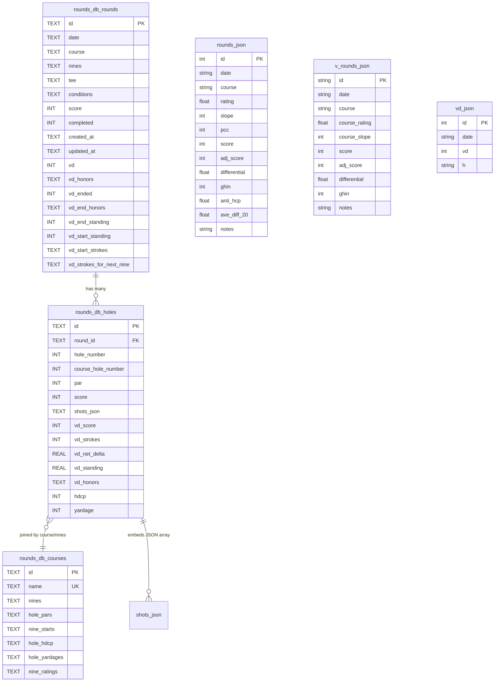
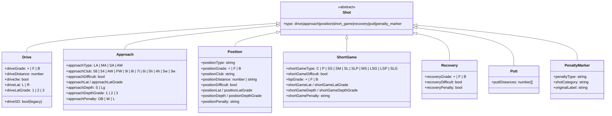
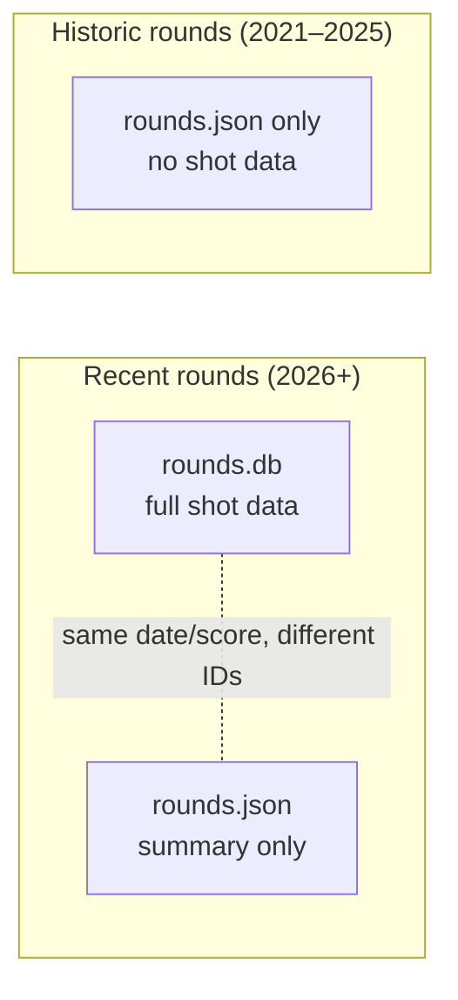

# Data Model

The system has **three independent data stores** with overlapping but distinct schemas.



## Store 1: `rounds.db` (SQLite — on Render server)

Three tables, all detailed above in [backend.md](./backend.md#sqlite-schema).

- `rounds` — one row per round, 18 columns including all VD match state
- `holes` — one row per played hole, 14 columns, shots embedded as JSON
- `courses` — one row per course, 8 columns, nearly all data JSON-encoded

## Store 2: `~/Desktop/golf-handicap/rounds.json`

386+ entries going back to 2021. Summary-only — no hole or shot data.

```json
{
  "id": 1,
  "date": "2021-08-22",
  "course": "Foothills to Mountain",
  "rating": 69.6,
  "slope": 128,
  "pcc": 0,
  "score": 111,
  "adj_score": 111,
  "differential": 36.5,
  "ghin": null,
  "anti_hcp": null,
  "ave_diff_20": null,
  "notes": ""
}
```

Used for: WHS handicap calculation (analysis app's `/hcp` page), bubble target, trend lines on `/trends`.

## Store 3: `~/Desktop/golf-handicap/vd.json`

97 entries. VD match running standings.

```json
{
  "id": 1,
  "date": null,
  "vd": 18,         // net standing (D − V); positive = D leads
  "h": null         // honors holder: "d" | "v" | null
}
```

Written by **both** the backend (`_update_vd_json` on completed VD round) **and** the analysis app's `/api/hcp/vd` POST endpoint.

## Store 4: `~/Desktop/golf-handicap/v_rounds.json`

V's summary rounds, schema parallel to `rounds.json`.

```json
{
  "id": "v001",
  "date": "2025-10-05",
  "course": "Foothills to Mountain",
  "course_rating": 69.3,
  "course_slope": 131,
  "score": 85,
  "adj_score": 85,
  "differential": 13.5,
  "ghin": null,
  "notes": ""
}
```

## Shot data model (embedded JSON in `holes.shots_json`)

All shot types share `{ type: string }` discriminator. Full taxonomy:



### Approach club categories (used by `/api/directional/approach/*`)

```js
APPROACH_CLUBS = {
  wedge:  ['58', '54', 'AW'],
  short:  ['PW', '9i', '8i'],
  medium: ['7i', '6i'],
  long:   ['5h', '4h', '5w', '3w'],
}
```

### Short-game type abbreviations

| Code | Meaning |
|------|---------|
| `C` | Chip |
| `P` | Pitch |
| `SS` | Sand Short |
| `SM` | Sand Medium |
| `SL` | Sand Long |
| `SLP` | Long Sand Putt-style |
| `MS` | (legacy) Medium Short |
| `LSG`, `LSP`, `SLG` | (legacy) various long-sand variants |

## Overlap & duplication



The `rounds.json` file is **manually maintained** (via `/hcp` page POST/DELETE) and predates the backend SQLite store. New rounds get entered into **both** systems — they're not auto-synced. This is the biggest refactor target: a single source-of-truth.
