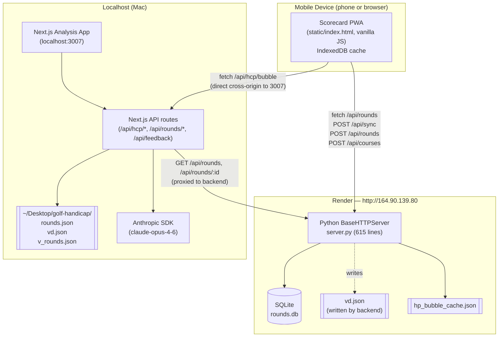
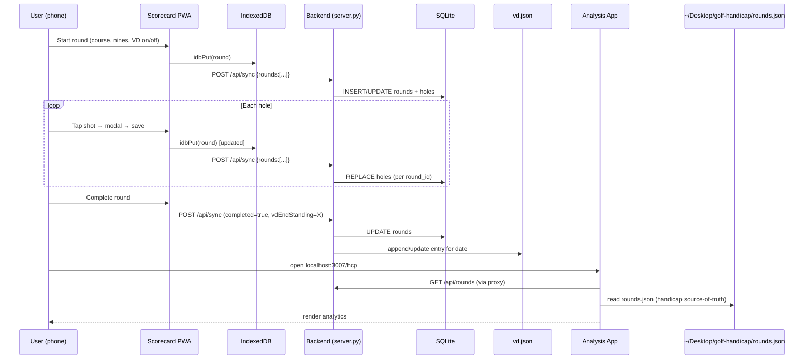

# System Overview

Two separate apps that share data, glued together by HTTP.

## Components

## Data flow (round of golf)

## Three data stores (the real picture)

The system has **three independent data stores**, not one:

| Store | Owner | Used by | Contains |
|-------|-------|---------|----------|
| `rounds.db` (SQLite) | golf-tracker backend | Scorecard PWA, golf-analysis (read-only proxy) | Detailed shot-by-shot round data — primary source for in-app analytics |
| `~/Desktop/golf-handicap/rounds.json` | golf-analysis (Next.js API routes) | HCP page, VD Match, Trends, Bubble | Summary rounds (date, score, rating, slope, differential) — **separate manual entries** going back to 2021 |
| `~/Desktop/golf-handicap/vd.json` | both — backend writes; analysis reads/writes | VD Match page | VD standings history (per date) |

`v_rounds.json` (also in golf-handicap) holds V's rounds and is a similar summary-only file.

There is **partial duplication** between the SQLite `rounds` table and `rounds.json` — they overlap for recent rounds but not for older ones. The refactor will need to decide which is the source-of-truth.
