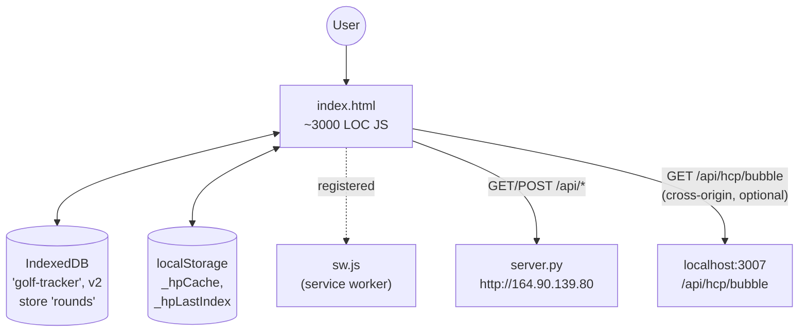

# Scorecard PWA — `golf-tracker/static/`

Single-file vanilla JavaScript PWA. ~3,039 lines of inline JS in `index.html`. No build step, no framework. Service worker (`sw.js`, ~38 lines) and PWA manifest enable home-screen install.

## Architecture



## Global state (`S`)

```js
const S = {
  tab: 'rounds',          // bottom-nav active tab
  view: 'rounds',         // rounds | setup | hole | complete | detail | settings
  rounds: [],             // list view rows
  courses: [],            // hydrated courses
  active: null,           // round being played
  holeIdx: 0,             // 0..(nHoles-1)
  modal: null,            // { type, step, data } — shot entry
  detailRound: null,      // round opened in detail view
  syncing: false,
  online: navigator.onLine,
  pendingIds: new Set(),  // round IDs awaiting sync
};
```

## Views

| View | Render fn | Purpose |
|------|-----------|---------|
| `rounds` | `renderRounds()` | List view, sorted by date desc |
| `setup` | `renderSetup()` | New round wizard — course, nines, HCP index, VD toggle |
| `hole` | `renderHole()` | Active round — hole-by-hole shot entry |
| `complete` | `renderComplete()` | Round summary after marking complete |
| `detail` | `renderRoundDetail()` | Read-only view of a saved round |
| `settings` | `renderSettings()` | Course management + export link |

Tabs (bottom nav): `rounds`, `play`, `settings`.

## IndexedDB schema

- DB name: `golf-tracker`, version 2
- Object store: `rounds`, keyPath `id`
- Holds the **full round object** (with holes and shots) so the app works fully offline. On reconnect, `syncToServer()` flushes any `pendingIds`.

## Round object (client-side shape)

```js
{
  id: "uuid",
  date: "YYYY-MM-DD",
  course: "Governors Club",
  nines: "Lakes/Foothills",
  tee: "White",
  conditions: "Clear, 70°F",
  score: 87,
  completed: false,
  vd: true,
  vdHonors: "D",
  vdEnded: false,
  vdEndHonors: "V",
  vdEndStanding: -2,            // net (D-V); positive = D ahead
  vdStartStanding: 0,
  vdStartStrokes: { ... },
  vdStrokesForNextNine: { ... },
  holes: [Hole]
}
```

## Hole object

```js
{
  id: "uuid",
  hole_number: 1,
  course_hole_number: 10,        // actual hole on course
  par: 4,
  score: 5,
  hdcp: 7,
  yardage: 348,
  shots: [Shot, …],
  // VD per-hole snapshot
  vScore: 5,
  vStrokes: 1,
  vNetDelta: 0,
  vStanding: -1,
  vHonors: "D"
}
```

## Shot taxonomy

Every shot has a `type` discriminator. Stroke count comes from `shotStrokeCount(shot)` (putts use `puttDistances.length`; penalty markers count 1; backward-compat penalty flags add +1).

### `drive`
```js
{ type: 'drive', driveGrade: '+'|'F'|'B', driveDistance: number, drive3w: bool,
  driveLat: 'L'|'R'?, driveLatGrade: 1|2|3?, driveSD: bool? /* legacy */ }
```

### `approach`
```js
{ type: 'approach', approachType: 'LA'|'MA'|'SA'|'AW',
  approachClub: '58'|'54'|'AW'|'PW'|'9i'|'8i'|'7i'|'6i'|'5h'|'4h'|'5w'|'3w'?,
  approachDifficult: bool,
  approachLat: 'L'|'R'?, approachLatGrade: 1|2|3?,
  approachDepth: 'S'|'Lg'?, approachDepthGrade: 1|2|3?,
  approachPenalty: 'OB'|'W'|'L'? }
```

### `position`
```js
{ type: 'position', positionType: string, positionGrade: '+'|'F'|'B',
  positionClub: string?, positionDistance: number|string?,
  positionDifficult: bool,
  positionLat, positionLatGrade, positionDepth, positionDepthGrade,
  positionPenalty }
```

### `short_game`
```js
{ type: 'short_game',
  shortGameType: 'C'|'P'|'SS'|'SM'|'SL'|'SLP'|'MS'|'LSG'|'LSP'|'SLG',
  shortGameDifficult: bool,
  lspGrade: '+'|'F'|'B'?,           // only for SLP
  shortGameLat, shortGameLatGrade, shortGameDepth, shortGameDepthGrade,
  shortGamePenalty }
```

### `recovery`
```js
{ type: 'recovery', recoveryGrade: '+'|'F'|'B',
  recoveryDifficult: bool, recoveryPenalty: bool }
```

### `putt`
```js
{ type: 'putt', puttDistances: number[] }   // strides; feet = strides × 3
```
Two storage models exist (analytics handles both):
- **Old:** one putt shot with `puttDistances: [d1, d2, d3]` (multiple distances on one shot)
- **New:** one shot per putt, `puttDistances: [d]`

### `penalty_marker`
```js
{ type: 'penalty_marker', penaltyType: string, shotCategory: string, originalLabel: string }
```
A standalone stroke representing a penalty. Replaces the legacy `*Penalty` flags on prior shot types.

## Cross-origin calls

The PWA makes **one cross-origin call** to the analysis app: `GET http://localhost:3007/api/hcp/bubble`. Result is cached in `localStorage._hpCache` and mirrored to the backend at `/api/hp-bubble-cache` so the value persists when the dev box is offline. Used in `renderSetup()` to display the handicap "bubble target" (score needed to lower index).

## Service worker

`sw.js` is registered but trivial — current version is essentially a network-passthrough. The `Cache-Control: no-store` on the SW asset ensures it isn't cached aggressively.
